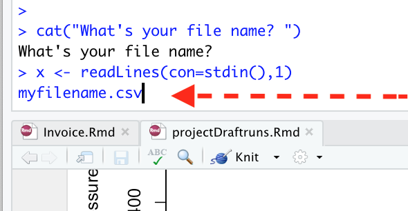

```{r setup, include=FALSE}
knitr::opts_chunk$set(echo = TRUE)
library(dplyr)
library(ggplot2)
library(lubridate)
library(openxlsx)
library(readxl)
library(stringr)
```

## reading csv data

### reading the file names in the directory

```{r}
dir<-"./data/Couplands_data_April_2021/"
files_to_read<-list.files(dir)
files_to_read[1]

```

### reading a csv file in - header, date
getting the business site name and date of the report

```{r, eval = FALSE}
a<-read.csv(file = paste0(dir, files_to_read[1]), header = F, nrows = 8) # read the header - first 8 rows
site_address<-a[1, c(6,7)] # get the address
d<-read.csv(file = paste0(dir, files_to_read[1]), header = T, skip = 8)
dates<- d %>% filter(TDESH %in% "TDESD") %>% select(Date) %>% .[["Date"]]# 'TDESD' seems to be the code for day-by-day transactions, col 3 has dates in dd/mm format
dates_s<-strsplit(as.character(dates), "/") # split the vector of dates by '/'. strisplit() outputs a list, every second sub-element is the month
month<-sapply(dates_s, "[[", 2) # something clever we have to credit mighty web for, gets every second sub-element of the list 
#month<-unique(sort(month)) # sort and get unique values
# if after sorting the month is of length 1 - it is all good and we can set it as a report date
```

## get the data to collate into further reports

### variable names

Var names come from the first row with 'IDMH' code ('H' for header?)

!!! check if 'IDMH'  appears once per spreadsheet. So far it is hard-coded that we take the first appearance of 'IDMH' as col names for the data

Note: the thing about conversion factors to strings is 

```{r}
data_col_names<-d[d$TDESH == "IDMH", ]
data_col_names<- data_col_names %>% mutate_if(is.factor, as.character) %>% gsub(" ", ".", .) 

```

select the data with 'IDMDT' as a code

```{r}
d_to_integrate<-d[d$TDESH %in% "IDMDT", ]
colnames(d_to_integrate)<-data_col_names
```


that one is for reading a list of site names Nathan is using

```{r, eval=FALSE}
site_names<-read.csv("./scratch/names_list.txt", header = FALSE, colClasses = "character")
head(site_names)
site_names<-unlist(as.vector(site_names[1,, drop = TRUE]))
site_names<-site_names[!is.na(site_names)]
site_names<-toupper(as.character(site_names))
```

looping over files in the directory

```{r}
list_of_data_to_integrate<-list()
list_of_dates<-list()
list_of_address<-list()
for (i in 1:length(files_to_read)){
  a<-read.csv(file = paste0(dir, files_to_read[i]), header = F, nrows = 8) # read the header - first 8 rows
list_of_address[[i]]<-a[1, c(6,7)] # get the address
d<-read.csv(file = paste0(dir, files_to_read[i]), header = T, skip = 8)
dates<-d %>% filter(TDESH %in% "TDESD") %>% select(Date) %>% .[["Date"]] # 'TDESD' seems to be the code for day-by-day transactions, col 3 has dates in dd/mm format
dates_s<-strsplit(as.character(dates), "/") # split the vector of dates by '/'. strsplit() outputs a list, every second sub-element is the month
month<-sapply(dates_s, "[[", 2) # something clever we have to credit mighty web for, gets every second sub-element of the list 
list_of_dates[[i]]<-unique(sort(month)) # sort and get unique values
# if after sorting the month is of length 1 - it is all good and we can set it as a report date

data_col_names<-d[d$TDESH == "IDMH", ]
data_col_names<- data_col_names %>% mutate_if(is.factor, as.character) %>% gsub(" ", ".", .) 
d_to_integrate<-d[d$TDESH %in% "IDMDT", ]
colnames(d_to_integrate)<-data_col_names

# making sure that we only have one month in each report
 if (length(list_of_dates[[i]]) ==1) {
 Month<-rep(list_of_dates[[i]], nrow(d_to_integrate))
 } else {
 month_col_i<-paste(list_of_dates[[i]], collapse = "_")
address_col_i<-paste(unlist(list_of_address[[i]]), collapse = " ")
 Month<- rep(month_col_i, nrow(d_to_integrate))
 }

#add month col to d_to_integrate
d_to_integrate<-cbind(Month, d_to_integrate)

list_of_data_to_integrate[[i]]<-d_to_integrate

}

# parsing the address:

site_name<-sapply(list_of_address, "[[", 1) %>% unlist() %>% as.character()
# get every first element of list_of_address[[]], which is the first line of the address
site_name<-site_name %>% str_replace_all(., "\\d[A|B|C|D]", "") %>% str_replace_all(., "\\d+", "")
# this line uses stringr library to remove all digits followed by letters "A", "B", "C" or "D" and then
# removes all digits altogether. 
# I'm doing it in two steps because I have not figured out how to remove a standalone letter
site_name<-site_name %>% str_replace_all(., "\\/", "") %>% str_replace_all(., "\\-", "") %>% str_replace_all(., "UNIT A", "") %>% str_replace_all(., "UNIT B", "") %>% str_replace_all(., "UNIT C", "") %>% str_replace_all(., "UNIT D", "") %>% str_replace_all(., "UNIT", "") %>% trimws()

# str_replace_all(., "\\/", "") gets out all '/' slashes
# str_replace_all(., "\\-", "")  gets out all dash symbols
# str_replace_all(., "UNIT A", "") gets rid of 'UNIT A' in the address - again because of standalone letters
# trimws() trims off the leading and training whitespace

for (i in 1:length(files_to_read)){
  
  Site<-rep(site_name[i], nrow(list_of_data_to_integrate[[i]]))
  list_of_data_to_integrate[[i]]<-cbind(Site, list_of_data_to_integrate[[i]])
  ### check that this works
  
}
```


creating a Mth_Data collated dataframe:

```{r}
library(data.table)

mth_data<-rbindlist(list_of_data_to_integrate, fill=FALSE, idcol=NULL)

```


## readxl

col_types = c("text", "text",	"date",	"text",	"text",	"numeric",	"numeric",	"numeric",	"numeric",	"numeric", "numeric",	"numeric",	"numeric")
```{r, eval = FALSE}

xlsxFile<-"20210503_Westpac_Merchant_Statements_332259464_00000_1_23772.xlsx"
a<- read_excel(xlsxFile, sheet = 1, col_names = TRUE, skip = 8, trim_ws = TRUE)
transaction_id<-c("TDESD")
```


## openxlsx
```{r, eval= FALSE}
xlsxFile<-"20210503_Westpac_Merchant_Statements_332259464_00000_1_23772.xlsx"
b<-read.xlsx(xlsxFile, sheet = 1, startRow = 9, cols = c(1:10), na.strings = "NA", colNames = TRUE, skipEmptyCols = TRUE, detectDates = TRUE)
b$Date<-convertToDate(b$Date)
```


```{r, eval = FALSE}
head(a)
```

Note that something strange is going on in the row 2 (Sales Amount, etc), but it is consistent result for both openxlsx::read.xls and  readxl::read_excel. There are similar rows downstream as well. We might use round(x, digits = 2), just have to check that it does not change cents amount and create discrepancy in the total sums

with convertToDate() dates entered in the format "12/4/2021" would have been read in correctly, those that are "13/04" are turned into NAs. Different formats are an artifact created by Excel in attempt to americanise the date format (it believes that first two digits are a month number and things go strange starting from the 13th day of each month)

## Stdin

you would have to type in the file name in the console pane:




```{r, eval=FALSE}
cat("What's your file name? ")
x <- readLines(con=stdin(),1)
print(x)
```


